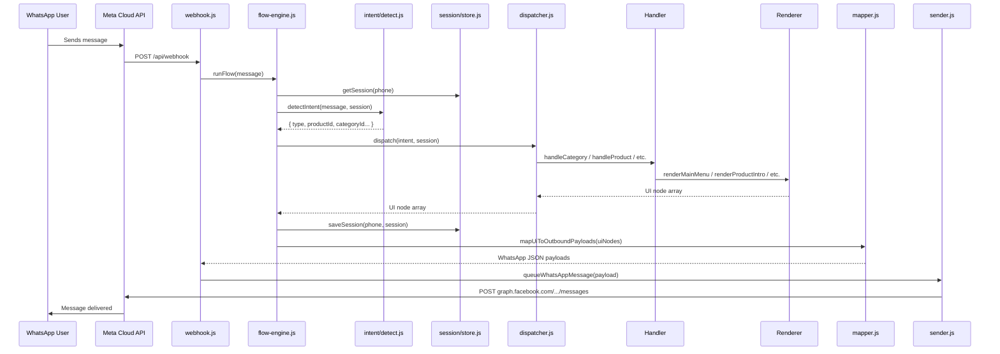

# Al-Mafnood Catalog System — Full Architecture Guide

## Overview

The entire catalog system lives inside `c:\Users\ihash\Desktop\CSA-Demo`. It's a **Vercel serverless function** that acts as a WhatsApp bot backend. There is **no database** — all products, categories, and recommendations are stored as JavaScript objects in flat files. Sessions are stored in-memory on the server.

---

## Project Structure

```
CSA-Demo/
├── api/
│   ├── webhook.js                      ← Entry point (Vercel serverless)
│   └── lib/
│       ├── flow-engine.js              ← Orchestrator
│       ├── intent/
│       │   └── detect.js               ← NLU / keyword matching
│       ├── session/
│       │   └── store.js                ← In-memory session (Map)
│       ├── content/                    ← 🗄️ THE CATALOG
│       │   ├── products.js             ← All product data (10 items)
│       │   ├── categories.js           ← Category definitions (2)
│       │   ├── recommendations.js      ← Shopping need profiles (9)
│       │   └── labels.js               ← Copy, button labels, footers
│       ├── conversation/
│       │   ├── router.js               ← Intent → Handler routing
│       │   ├── dispatcher.js           ← Handler switch
│       │   └── handlers/
│       │       ├── category.js         ← Main menu + category browsing
│       │       ├── product.js          ← Product intro + specs
│       │       ├── pricing.js          ← Stock + delivery info
│       │       ├── order.js            ← Order capture flow
│       │       └── handoff.js          ← Human specialist redirect
│       ├── renderers/                  ← UI node builders
│       │   ├── ui-types.js             ← uiCard, uiList, uiImage, etc.
│       │   ├── category.js             ← Renders menus
│       │   ├── product.js              ← Renders product cards
│       │   ├── pricing.js              ← Renders pricing cards
│       │   ├── order.js                ← Renders order capture
│       │   └── handoff.js              ← Renders specialist handoff
│       └── transport/
│           └── whatsapp/
│               ├── mapper.js           ← UI nodes → WhatsApp JSON
│               ├── limits.js           ← Platform constraints (72 chars, etc.)
│               └── sender.js           ← Graph API HTTP calls + queue
└── assets/                             ← Product images (deployed to Vercel)
```

---

## The Request Lifecycle



---

## Where Products Are Stored

**File:** [products.js](file:///c:/Users/ihash/Desktop/CSA-Demo/api/lib/content/products.js)

Every product is a JS object built through `buildProduct()`:

| Field | Purpose | Example |
|---|---|---|
| `id` | Unique key | `'gaming_laptop'` |
| `category` | Links to category ID | `'computing'` |
| `label` | Full display name | `'ASUS TUF Gaming A15 Laptop'` |
| `shortLabel` | Button/list display | `'TUF Gaming A15'` |
| `summary` | One-liner description | Used in product intro |
| `heroImageUrl` | Product photo URL | Served from `/assets/` on Vercel |
| `listDescription` | 72-char max list preview | Shown in category menus |
| `specs[]` | Technical spec lines | Rendered as bullet list |
| `benefits[]` | Key selling points | Rendered in product intro |
| `idealFor[]` | Use-case targets | Rendered in product intro |
| `customerLikes[]` | Social proof points | Rendered in product intro |
| `priceRange` | Price or "ask" text | Shown in pricing screen |
| `included[]` | Box contents | Shown in pricing screen |
| `availabilityNote` | Stock status text | Shown in pricing screen |
| `deliveryEstimate` | Shipping ETA | Shown in pricing screen |
| `keywords[]` | Intent matching terms | Used by `detect.js` |

### Current Inventory: 10 Products

**Computing (4):** HyperVault White PC, TUF Gaming A15, IdeaPad Slim 3, Office Desktop Bundle

**Accessories (6):** Anker P20i, Bone Conduction, Truefree Open Ear, Redragon KB+Mouse, TP-Link Router, MSI 27" Monitor

---

## Where Categories Are Stored

**File:** [categories.js](file:///c:/Users/ihash/Desktop/CSA-Demo/api/lib/content/categories.js)

Two categories: `computing` (PCs & Laptops) and `audio` (Accessories & Networking). Each has:
- `menuDescription` — shown in the list row (72 char limit)
- `menuIntro` — shown as the body text when browsing
- `keywords[]` — for intent detection from free-text

---

## How Intent Detection Works

**File:** [detect.js](file:///c:/Users/ihash/Desktop/CSA-Demo/api/lib/intent/detect.js)

Priority order (first match wins):

1. **Button/List reply** — user tapped a WhatsApp button → parse the reply ID directly
2. **Product keyword** — free text matches a product's `keywords[]`
3. **Shopping need** — matches recommendation profiles (e.g., "gym", "gaming", "student")
4. **Category keyword** — matches a category's `keywords[]`
5. **Action keywords** — "specs", "price", "order", "compare", "human"
6. **Navigation** — "hi", "hello", "menu", "start"
7. **Unknown** — fallback

---

## Session Management

**File:** [store.js](file:///c:/Users/ihash/Desktop/CSA-Demo/api/lib/session/store.js)

Sessions are a simple `Map()` in server memory. Each user gets:

```js
{ phone, flow, step, category, product, shopperNeed, handoffRequested, orderDraft }
```

> [!WARNING]
> Sessions are **lost on every Vercel cold start**. This is fine for demos but would need Redis/Firebase for production.

---

## The Rendering Pipeline

Handlers return **platform-agnostic UI nodes** (not WhatsApp JSON). Available node types from [ui-types.js](file:///c:/Users/ihash/Desktop/CSA-Demo/api/lib/renderers/ui-types.js):

| Node Type | WhatsApp Output | Used For |
|---|---|---|
| `uiText` | Plain text message | Simple replies |
| `uiImage` | Image message | Standalone photos |
| `uiCard` | Interactive button message (+ optional image header) | Product cards, pricing, orders |
| `uiActionList` | Interactive button message | Fallback menus |
| `uiList` | Interactive list message | Category browsing |
| `uiLink` | CTA URL message | Specialist handoff link |

The **mapper** ([mapper.js](file:///c:/Users/ihash/Desktop/CSA-Demo/api/lib/transport/whatsapp/mapper.js)) translates these into WhatsApp Cloud API JSON, enforcing all platform limits automatically.

---

## The Delivery Queue

**File:** [sender.js](file:///c:/Users/ihash/Desktop/CSA-Demo/api/lib/transport/whatsapp/sender.js)

Messages are sent sequentially per-user with a 650ms delay between each. This prevents WhatsApp from rejecting rapid-fire messages and ensures messages arrive in the correct order.

---

## How to Add a New Product

1. Add the product object to `productCatalog` in `products.js`
2. Add a hero image to `assets/` folder
3. Run `vercel --prod --yes` to deploy
4. The product will automatically appear in its category's list menu and respond to keyword searches
