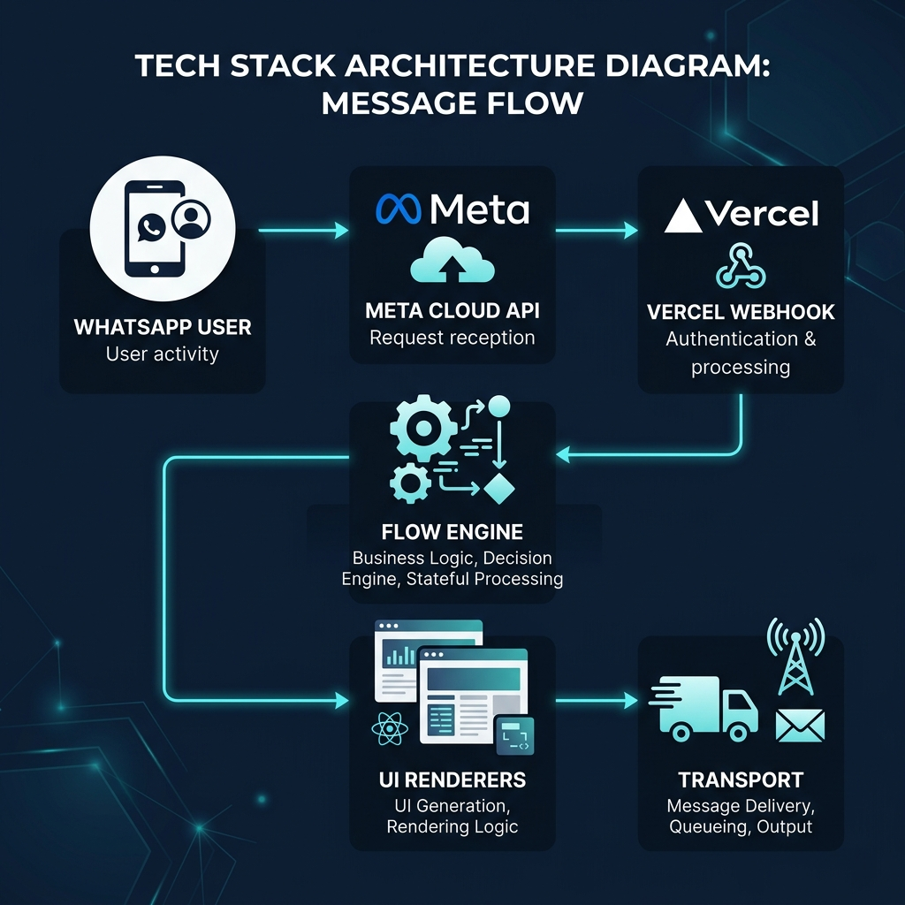
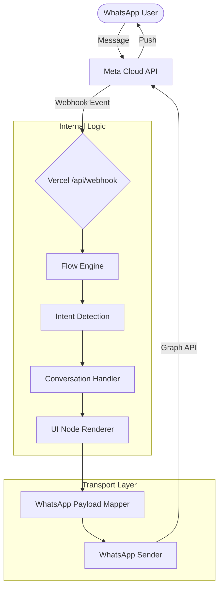

# Architecture Pipeline

This document explains the end-to-end runtime pipeline.

## Request Lifecycle

## Component Roles

| Component | Responsibility |
| --- | --- |
| **api/webhook.js** | Receives and verifies Meta Graph API events. |
| **flow-engine.js** | The orchestrator. Manages sessions and dispatches logic. |
| **api/lib/intent/** | Detects user intent (Category, Product, Navigation). |
| **api/lib/renderers/** | Converts logical responses into platform-agnostic UI nodes. |
| **api/lib/transport/** | Maps UI nodes to WhatsApp payloads and sends them. |

## Webhook Verification

Meta sends a `GET /api/webhook` request to verify the server. The function compares `hub.verify_token` with your environment variables and returns `hub.challenge`.

## Payload Mapping & Guardrails

The system building UI nodes first ensures that business logic remains independent of platform limits. The **WhatsApp Mapper** then enforces:
- **Body/Caption**: 1024 chars
- **List Row Description**: 72 chars
- **Button Labels**: 20 chars

## Guided Flow Structure

1. **Main Menu**
2. **Category Intro** (Gaming PCs, Audio)
3. **Product Selection**
4. **Guided Detail** (Specs, Availability, Specialist Handoff)
