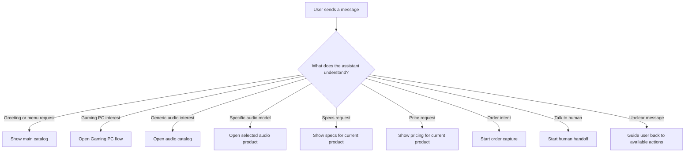
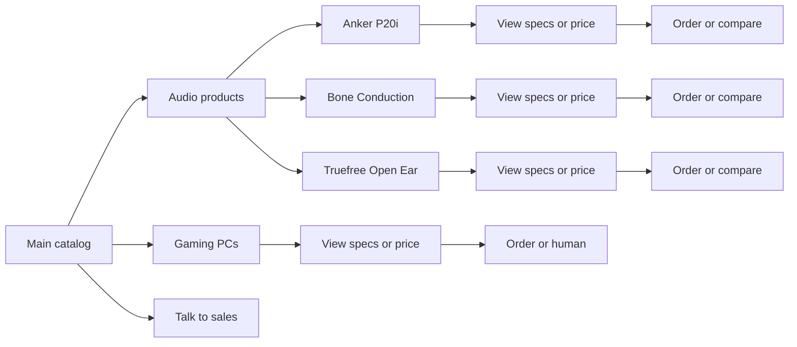
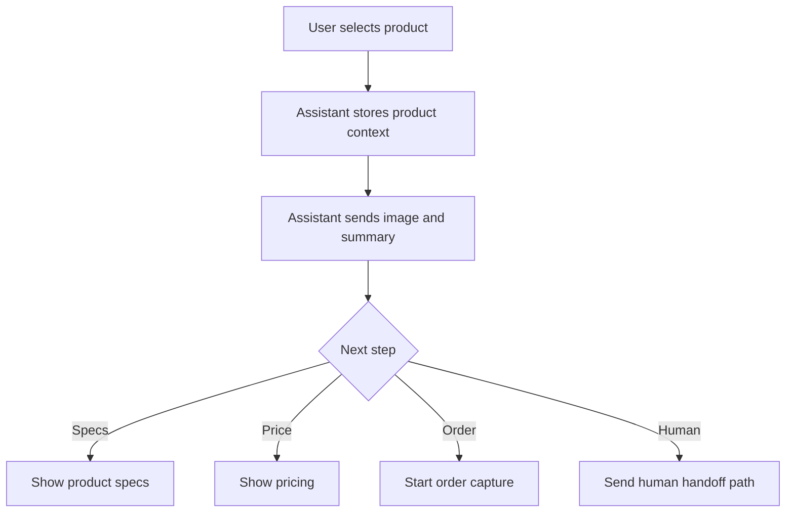

# Current Application and AI Interaction Flow

This document describes the user-facing conversation flow only.

## Big Picture



## Main Journey



## 1. Main Catalog

When the user says:

- `hi`
- `hello`
- `start`
- `menu`
- `catalog`

The assistant opens a short catalog entry point with:

- `Gaming PCs`
- `Audio products`
- `Talk to sales`

Purpose:

- reduce ambiguity
- get the user into the right lane fast
- keep the conversation structured

## 2. Product Recognition

The assistant can recognize both categories and exact products from free text.

### Gaming PC triggers

- `pc`
- `computer`
- `gaming pc`
- `gaming desktop`

Action:

- opens the Gaming PC flow
- shows summary
- offers `View specs` and `See price`

### Generic audio triggers

- `headphone`
- `headphones`
- `earphone`
- `earbuds`
- `open ear`
- `audio`

Action:

- opens the audio catalog
- lets the user pick one exact model

### Exact audio product triggers

Anker P20i:

- `anker`
- `p20i`
- `soundcore`

Bone conduction model:

- `bone conduction`
- `running headphone`
- `sports headphone`

Truefree Open Ear:

- `truefree`
- `earhook`
- `54h`

Action:

- opens the exact product flow
- sends image plus captioned summary
- offers the next guided step

## 3. Product Conversation Structure



The conversation is intentionally short:

- product first
- product detail second
- conversion third

## 4. Audio Catalog Communication Upgrade

The previous flow treated headphones like one broad product.

The current flow is better because it:

- separates generic audio interest from exact product interest
- keeps one product context at a time
- allows product comparison without losing structure
- sends the right image for the exact selected model

## 5. Specs Flow

When the user asks for specs, the assistant sends a short bullet summary for the active product.

Gaming PC path:

- `See price`
- `Audio catalog`

Audio path:

- `See price`
- `More audio`

## 6. Pricing Flow

When the user asks for price, the assistant sends:

- product name
- price or live-pricing note
- short qualification that final price depends on stock or variant

Then it offers:

- `Order now`
- `Talk to sales`

## 7. Order Flow

When the user shows buying intent, the assistant asks for:

1. full name
2. location
3. preferred model or color

Then it offers:

- `Talk to sales`
- `Main menu`

## 8. Human Handoff

When the user requests a person, agent, or sales help, the assistant:

1. confirms human handoff
2. sends the contact CTA

## 9. Fallback Logic

If the user sends something unclear:

- inside an audio product flow, the assistant offers `View specs` or `More audio`
- inside another product flow, the assistant offers `View specs` or `See price`
- without a product context, the assistant goes back to the main catalog

## 10. Core Design Logic

The conversation is designed to move like this:

```text
Interest -> Category or Product -> Specs or Price -> Order or Human
```

The core rules are:

- detect the closest product intent quickly
- avoid chatty filler
- always offer the next action
- keep communication clean and conversion-focused
