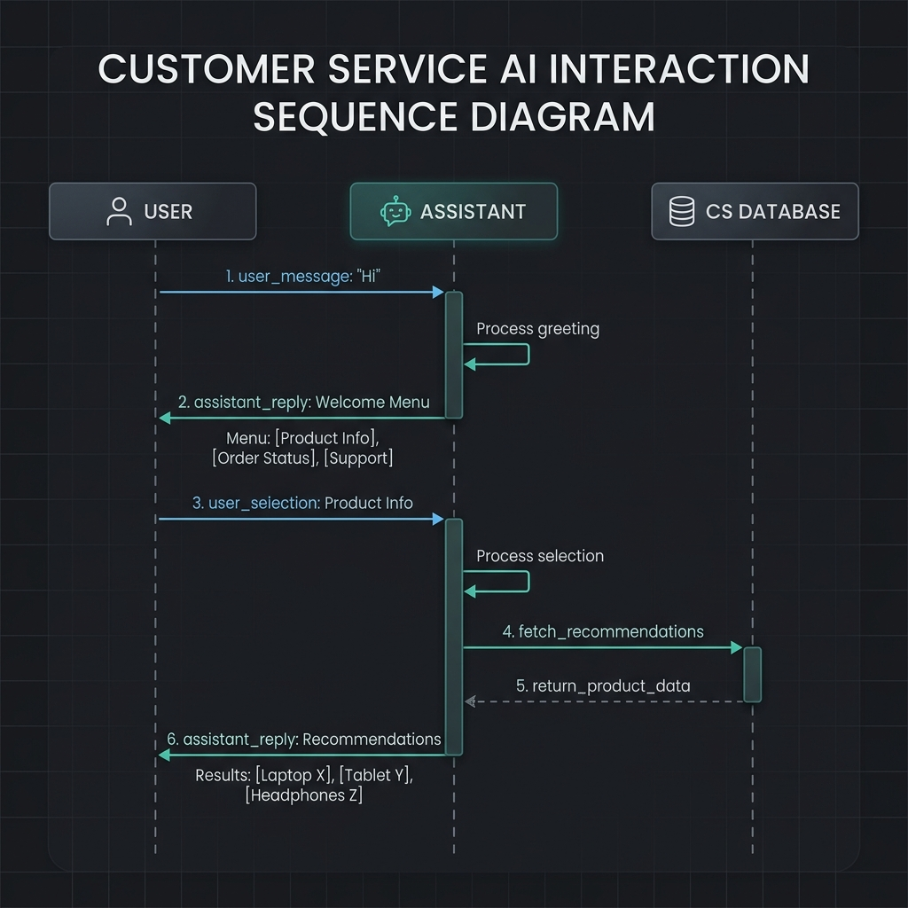
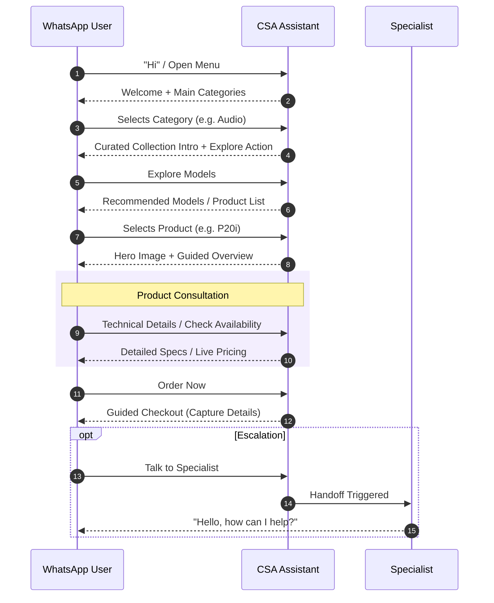

# Current Application and AI Interaction Flow



This document describes the current user-facing conversation style for the WhatsApp assistant.

## Brand Direction

The assistant should feel like:

- a premium sales assistant
- concise and polished
- recommendation-driven instead of menu-driven
- helpful under pressure, not chatty

The target tone is guided shopping, not database output.

## Main Entry Experience

When the user opens the chat or asks for the menu, the assistant replies with:

```text
Welcome to CSA Store.
Premium tech products with guided recommendations.

Select a category to continue.
```

Main catalog options:

- `Gaming PCs`
- `Audio Collection`
- `Talk to Specialist`

## Core Flow Shape



## Category Experience

### Audio Collection

The assistant presents audio as a curated collection, not a raw product list.

Category copy is framed like:

```text
From daily-use earbuds to performance-focused open-ear models.
Choose the type of listening experience you want to explore.
```

The action label for opening the catalog is:

- `Explore Models`

## Product Discovery Logic

The assistant can open products in three ways:

1. Direct product name detection
2. Category detection
3. Shopping-need detection

### Direct product examples

- `anker`
- `p20i`
- `truefree`
- `bone conduction`

### Shopping-need examples

- `gym`
- `running`
- `calls`
- `travel`
- `bass`

When a shopping need is detected, the assistant should recommend models before the user browses the full list.

Example direction:

```text
Recommended for you
For gym use, we usually prioritize fit, water resistance, and battery stability.
```

## Product Card Structure

Each selected product should feel like a guided consultation.

The product card structure is:

1. product name
2. concise positioning statement
3. `Ideal for`
4. `Key Features`
5. `What customers usually like`

This makes the reply feel curated instead of machine-generated.

## Primary Action Labels

The preferred action labels are:

- `Technical Details`
- `Check Availability`
- `Order Now`
- `Compare Models`
- `Talk to Specialist`
- `Connect Specialist`

Avoid robotic labels like:

- `View specs`
- `See price`
- `Talk to sales`

## Pricing Experience

Pricing replies should not stop at the number.

They should include:

- current price or live-pricing note
- what is included
- availability note
- estimated delivery timing

This makes the business feel more credible and ready to sell.

## Order Experience

Order prompts should read like assisted checkout, not raw data capture.

Recommended structure:

```text
Ready to place your order?

Please reply with:
1. Full name
2. Delivery location
3. Preferred model or color
4. Quantity if needed
```

## Specialist Handoff

Human escalation should feel intentional and premium.

Recommended framing:

```text
Need personal assistance?

Our product specialist can help with:
- Product comparisons
- Availability checks
- Bulk orders
- Business purchases
- Faster recommendations
```

CTA label:

- `Connect Specialist`

## Fallback Behavior

If the user sends an unclear message while inside a product path, the assistant should gently guide them back to:

- `Technical Details`
- `Check Availability`
- `Compare Models`
- `Talk to Specialist`

If there is no active context, return to the main catalog.

## Golden Rule

Every message should feel like:

- helping
- guiding
- consulting

Never like:

- dumping product rows
- exposing backend structure
- repeating flat catalog text
