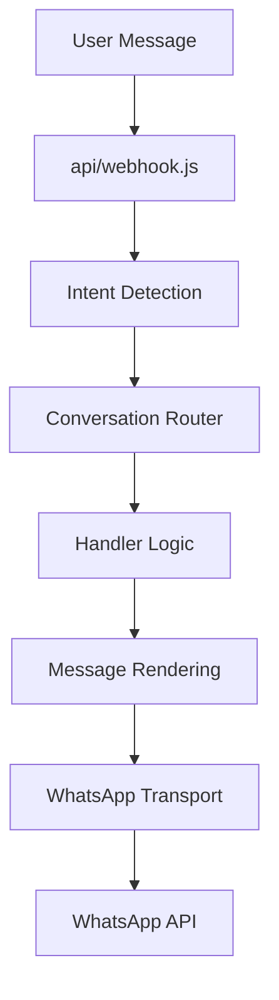
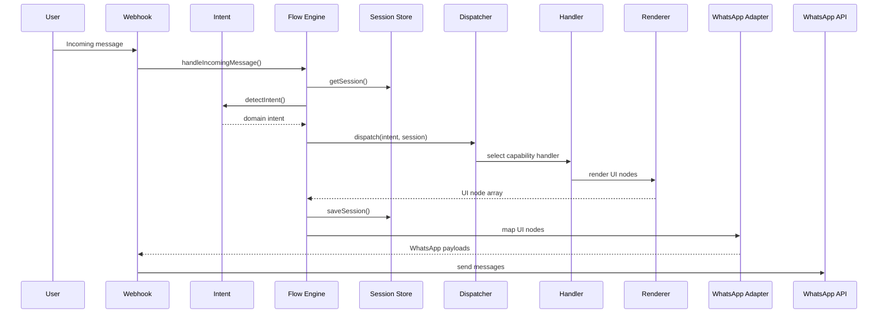

# Architecture

This document explains how the current CSA-Demo WhatsApp assistant works at a system level.

## System Map

```text
User
  ↓
Webhook
  ↓
Intent Detection
  ↓
Conversation Router
  ↓
Handler Logic
  ↓
Message Rendering
  ↓
Transport Adapter
  ↓
WhatsApp
```

This is the shortest accurate explanation of the runtime today.

## Runtime Overview



## Folder View

Current code is now split into layered folders inside `api/lib/`:

```text
api/
├── webhook.js
└── lib/
    ├── content/
    ├── conversation/
    ├── intent/
    ├── renderers/
    ├── session/
    ├── transport/
    ├── flow-engine.js
```

## Responsibility Map

| Concern | Current owner |
| --- | --- |
| Product facts | `api/lib/content/products.js` |
| Category and recommendation copy | `api/lib/content/categories.js`, `api/lib/content/recommendations.js`, `api/lib/content/labels.js` |
| Intent parsing | `api/lib/intent/detect.js` |
| Session memory | `api/lib/session/store.js` |
| Conversation routing and handler dispatch | `api/lib/conversation/` |
| UI rendering | `api/lib/renderers/` |
| WhatsApp payload shaping and guardrails | `api/lib/transport/whatsapp/mapper.js`, `limits.js` |
| WhatsApp sending and queueing | `api/lib/transport/whatsapp/sender.js` |
| Webhook entrypoint | `api/webhook.js` |

## Current Layer Mapping

The runtime now behaves like this:

| Layer | Current files | Responsibility |
| --- | --- | --- |
| Domain / Content | `content/` | Business truth, copy, product metadata |
| Conversation | `intent/`, `conversation/`, `session/` | Meaning, routing, session state |
| Rendering | `renderers/` | Builds platform-agnostic UI nodes |
| Transport | `transport/whatsapp/` | Converts UI nodes into WhatsApp-safe payloads and sends them |
| Delivery | `webhook.js` | Receives inbound events and queues outbound sends |

## Why The System Feels Scattered

The system is more separated now, but one file still marks the orchestration boundary.

`api/lib/flow-engine.js` should stay intentionally small and only handle:

- loading session
- detecting intent
- dispatching to handlers
- mapping UI nodes into transport payloads
- saving session

That is the correct architecture direction.

## Current Data Flow



## Current Strengths

- Product content is centralized in `content/products.js`
- Labels and recommendation profiles are centralized in `content/labels.js` and `content/recommendations.js`
- WhatsApp limits are isolated in `transport/whatsapp/limits.js`
- Payload mapping is separated from business handlers
- Session state is separated from webhook transport

## Current Weaknesses

- Some conversational capability boundaries can still be refined further
- Docs and tests now need to keep up with the new layering
- The session layer is still in-memory only

## Recommended Next Structure

Current structure:

```text
api/
├── content/
├── conversation/
├── intent/
├── renderers/
├── session/
├── transport/
└── webhook.js
```

This repo now follows that structure in code, even though future sub-splitting is still possible.

## Best Next Refactor

The next safe architecture step after this refactor is:

1. Strengthen handler contracts
2. Expand platform-agnostic UI nodes where needed
3. Add tests around dispatcher and mapper behavior
4. Move session persistence out of memory

## Why Renderers Must Be Separate

The system should build conversation UI first, and WhatsApp payloads second.

Reason:

- business logic should not care about button limits
- content should not care about caption length
- future Telegram / web chat support should not require handler rewrites

That is the key architecture boundary for long-term scale.
