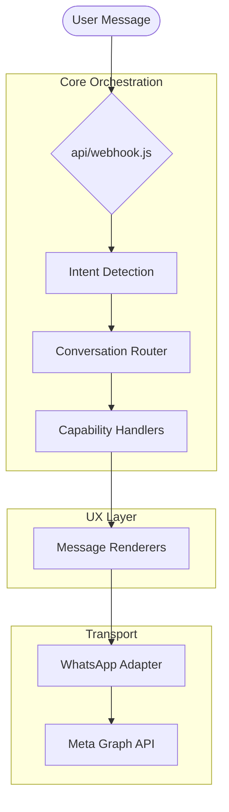

# Architecture

This document explains the CSA-Demo WhatsApp assistant architecture.

## Runtime Overview

## Codebase Layers

Current code is split into layered folders inside `api/lib/`:

| Layer | Path | Responsibility |
| --- | --- | --- |
| **Domain** | `content/` | Business truth, products, and copy |
| **Conversation** | `intent/`, `conversation/` | Intent detection, routing, and logic |
| **Session** | `session/` | State persistence and context |
| **Rendering** | `renderers/` | Builds platform-agnostic UI nodes |
| **Transport** | `transport/whatsapp/` | WhatsApp mapping and Graph API delivery |

## Data Flow Sequence

```mermaid
sequenceDiagram
    autonumber
    participant U as User
    participant W as Webhook
    participant R as Flow Engine
    participant S as Session Store
    participant H as Handler
    participant N as Renderer
    participant T as WhatsApp Adapter
    participant WA as Meta Graph API

    U->>W: Incoming message
    W->>R: handleIncomingMessage()
    
    rect rgb(30, 27, 75)
        Note over R,S: State & Context
        R->>S: getSession()
        R->>R: detectIntent()
    end
    
    R->>H: dispatch(intent, session)
    
    rect rgb(131, 24, 67)
        Note over H,N: UI Construction
        H->>N: render UI nodes
        N-->>R: UI node array
    end
    
    R->>S: saveSession()
    
    rect rgb(6, 78, 59)
        Note over R,T: Payload Mapping
        R->>T: map UI nodes
        T-->>W: WhatsApp payloads
    end
    
    W->>WA: POST /messages
```

## Key Architectural Principles

1.  **Platform Agnostic Logic**: Handlers return UI nodes (text, list, etc.) instead of raw WhatsApp JSON.
2.  **Centralized Content**: All product data and labels live in `api/lib/content/`.
3.  **Strict Transport Limits**: WhatsApp-specific constraints (72 chars for descriptions, etc.) are isolated in the transport layer.
