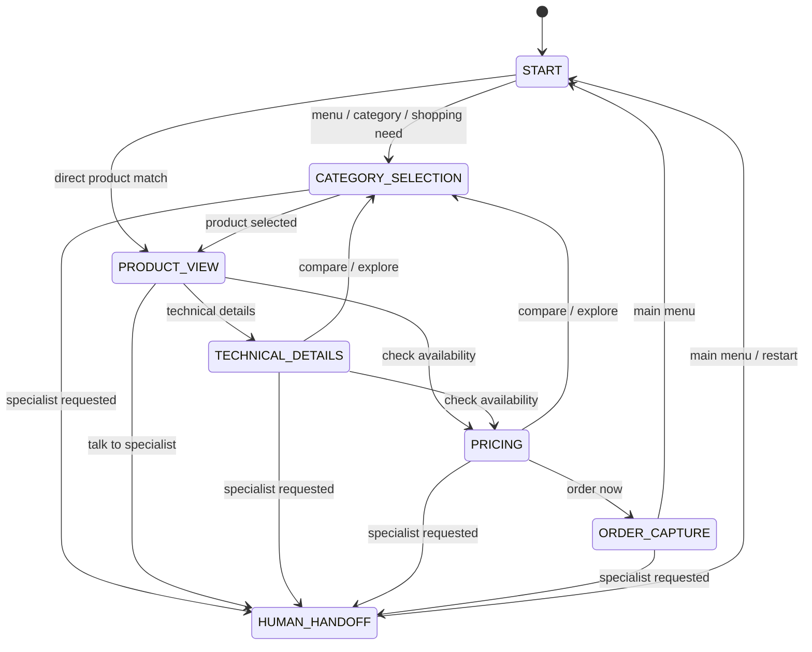

# State Machine

This document explains the conversational state model used by the current WhatsApp assistant.

## Main States

```text
START
  ↓
CATEGORY_SELECTION
  ↓
PRODUCT_VIEW
  ↓
TECHNICAL_DETAILS
  ↓
PRICING
  ↓
ORDER_CAPTURE
  ↓
HUMAN_HANDOFF
```

Not every user goes through every step, but this is the core progression.

## State Graph



## Current Session Shape

Current runtime session fields from `api/lib/session/store.js`:

```js
{
  phone,
  flow,
  step,
  category,
  product,
  shopperNeed,
  handoffRequested,
  orderDraft,
  lastUpdatedAt
}
```

## State Meanings

| Field | Meaning |
| --- | --- |
| `flow` | High-level conversation family. Currently `product_inquiry`. |
| `step` | Current point in the flow, such as `start`, `product_selected`, `pricing`, or `human_handoff`. |
| `category` | Active category such as `computing` or `audio`. |
| `product` | Active product id such as `pc` or `anker_p20i`. |
| `shopperNeed` | Recommendation context like `gym`, `running`, `calls`, `travel`, or `bass`. |
| `handoffRequested` | Whether the user has already requested specialist support. |
| `orderDraft` | Placeholder for order capture data. |

## How State Is Chosen

Current decision order in the runtime:

1. Navigation intent
2. Shopping-need intent
3. Category intent
4. Product intent
5. Product action intent
6. Order / human decision intent
7. Fallback behavior

This matters because some phrases can qualify as more than one thing. The system always resolves using the ordering above.

## Shopping Need Memory

`shopperNeed` is a lightweight recommendation memory.

It lets the assistant keep context like:

- gym use
- running
- calls
- travel
- bass preference

That memory influences:

- recommendation banners
- product image captions
- overview phrasing

## State Ownership

| Concern | Owner |
| --- | --- |
| State persistence | `api/lib/session/store.js` |
| State transitions | `api/lib/conversation/handlers/` plus `api/lib/flow-engine.js` orchestration |
| State interpretation | `api/lib/intent/detect.js` and `api/lib/conversation/` |

The flow engine is smaller now, but state behavior still depends on handler-level mutations.

## Future Direction

The long-term improvement is to move from implicit step changes inside `flow-engine.js` to explicit transition handlers.

Target shape:

```text
session/
├── store.js
├── transitions.js
├── guards.js
└── context-builder.js
```

That would make state behavior easier to reason about and easier to draw on a whiteboard.
