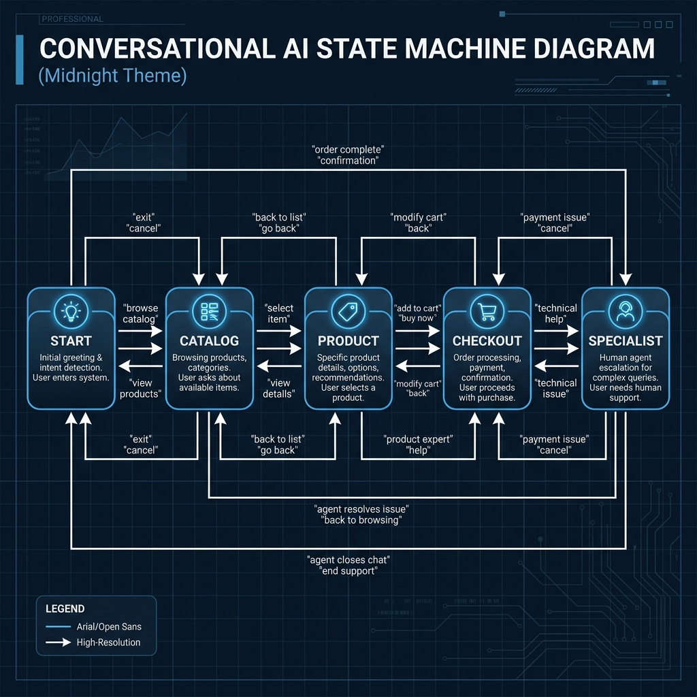
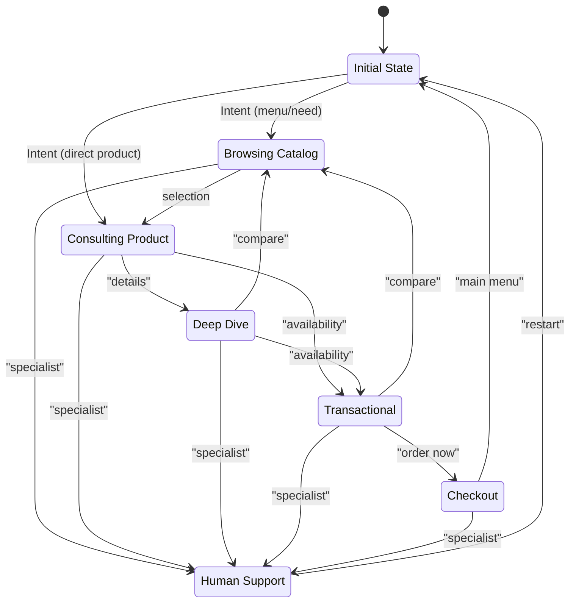

# State Machine

This document explains the conversational state model used by the WhatsApp assistant.

## State Graph

## Session Context

The state is maintained in the session object (stored in `api/lib/session/store.js`):

| Field | Description |
| --- | --- |
| `flow` | Current conversation family (e.g., `product_inquiry`). |
| `step` | Specific point in the flow (e.g., `start`, `pricing`). |
| `category` | The active product category. |
| `product` | The active product ID. |
| `shopperNeed` | Recommendation context (e.g., `gym`, `bass`). |

## Decision Hierarchy

The system resolves user intent in this order:
1. Navigation -> 2. Shopping Need -> 3. Category -> 4. Product -> 5. Action -> 6. Fallback.
